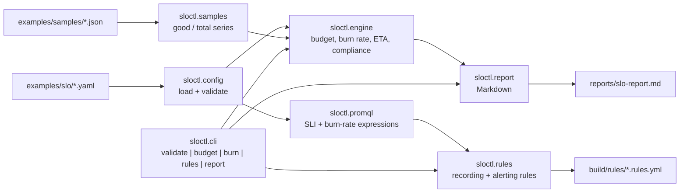

# slo-error-budget-lab

A library and CLI that turns declarative SLI/SLO definitions into auditable numbers — error budget, multi-window burn rate, exhaustion ETA — and into `promtool`-valid Prometheus recording and alerting rules, entirely offline.

[](https://github.com/dayxus/slo-error-budget-lab/actions/workflows/ci.yml)
[](LICENSE)
[](pyproject.toml)

## What it does

- Loads SLO definitions from plain YAML (`objective`, `window`, SLI query, labels) and fails with a clear message when one is invalid — no Prometheus, no network, no exotic dependency.
- Computes the error budget of each service from synthetic good/total sample series: total budget, time consumed, remaining percentage, and `compliant` / `violated` status.
- Computes the burn rate over four lookback windows (1h, 6h, 1d, 3d) with a verdict per window (`ok` / `slow burn` / `fast burn`) and the projected exhaustion ETA.
- Generates Prometheus rule files — recording rules for the SLI ratio, the remaining error budget and the per-window burn rate, plus multi-window multi-burn-rate alerts at 14.4x (1h/5m), 6x (6h/30m) and 1x (3d/6h) with `severity: page` / `severity: ticket`.
- Renders `reports/slo-report.md`, a Markdown report with every budget and burn-rate table the CLI prints.
- Runs the whole pipeline as a library: `from sloctl import engine` gives the same numbers the CLI prints, and `tests/` pins them to known answers.

## Why it matters for SRE

An SLO is only useful if the number behind it is reproducible. This repo is the calculator, isolated from the metrics backend: the same formulas an on-call engineer argues about at 03:00 — `budget = window * (1 - objective)`, `burn_rate = (1 - good/total) / (1 - objective)`, `ETA = remaining / burn_rate` — are implemented once, tested against hand-computed answers, and documented in `docs/slo-theory.md`. The generated alerting rules follow the multi-window multi-burn-rate pattern from the Google SRE Workbook, so a page means "the budget is being spent too fast to survive the window" instead of "an error rate crossed a number someone guessed". Because the sample series are synthetic fixtures, the behavior is auditable without access to any production system.

## Architecture



`sloctl.models` holds the dataclasses (`SLISpec`, `SLO`, `Budget`, `BurnWindow`, `Evaluation`); `sloctl.cli` is a thin `argparse` layer with meaningful exit codes.

## Quickstart

Requires Python 3.11+ (the tests and CI run on 3.11, 3.12 and 3.13). Everything below runs offline.

```bash
git clone https://github.com/dayxus/slo-error-budget-lab.git
cd slo-error-budget-lab
make setup          # creates .venv and installs the package with dev deps
make test           # 148 tests
make budget         # error budget table for the three example services
make burn           # multi-window burn rate table
make demo           # writes reports/slo-report.md and build/rules/*.rules.yml
make promtool-check # downloads the newest promtool and validates the generated rules
```

The three bundled examples are `checkout` (99.9% over 30d, healthy), `payments` (99.95% over 30d, burning) and `search` (99.5% over 30d, already over budget).

## Verify it yourself

Every block below is the literal output of the command above it, on a clean clone.

`make test`:

```
.venv/bin/python -m pytest -q
........................................................................ [ 48%]
........................................................................ [ 97%]
....                                                                     [100%]
148 passed in 1.31s
```

`python -m sloctl budget --config examples/slo --samples examples/samples`:

```
SERVICE   SLI           OBJECTIVE  WINDOW  BUDGET   CONSUMED  REMAINING  STATUS
--------  ------------  ---------  ------  -------  --------  ---------  ---------
search    availability  99.5%      30d     3h 36m   5h 2m     -40%       violated
checkout  availability  99.9%      30d     43m 12s  2m 9s     95%        compliant
payments  availability  99.95%     30d     21m 36s  9m 50s    54.5%      compliant

3 service(s) evaluated, 2 compliant, 1 over budget
```

The budget column is the spec's math, recomputed: 99.9% over 30d is `43200 min * 0.001 = 43m 12s`, 99.95% is `21m 36s`, 99.5% is `3h 36m`. `tests/test_engine.py` pins those three values.

`python -m sloctl burn --config examples/slo --samples examples/samples`:

```
SERVICE   WINDOW  GOOD / TOTAL             ERROR RATIO  BURN RATE  VERDICT    ETA
--------  ------  -----------------------  -----------  ---------  ---------  ---------
search    1h      119,159 / 120,000        0.701%       1.40x      slow burn  exhausted
search    6h      714,907 / 720,000        0.707%       1.41x      slow burn  exhausted
search    1d      2,859,622 / 2,880,000    0.708%       1.42x      slow burn  exhausted
search    3d      8,579,331 / 8,640,000    0.702%       1.40x      fast burn  exhausted
checkout  1h      239,991 / 240,000        0.004%       0.04x      ok         760d 1h
checkout  6h      1,439,936 / 1,440,000    0.004%       0.04x      ok         641d 7h
checkout  1d      5,759,712 / 5,760,000    0.005%       0.05x      ok         570d 1h
checkout  3d      17,279,132 / 17,280,000  0.005%       0.05x      ok         567d 10h
payments  1h      176,400 / 180,000        2%           40.00x     fast burn  9h 48m
payments  6h      1,076,224 / 1,080,000    0.35%        6.99x      fast burn  2d 8h
payments  1d      4,315,573 / 4,320,000    0.102%       2.05x      slow burn  7d 23h
payments  3d      12,953,825 / 12,960,000  0.048%       0.95x      ok         17d 3h

12 window(s) measured across 3 service(s); 3 at or above the page threshold
alerting now: payments@1h (fast burn), payments@6h (fast burn), search@3d (fast burn)
```

`python -m sloctl rules generate ...` followed by `promtool check rules` on the newest official Prometheus release:

```
promtool, version 3.14.0 (branch: HEAD, revision: d7598b7141418fa35be2b5ec5d0fefb634199610)
  build user:       root@4c568bad4aae
  build date:       20260817-16:46:08
```

```
Checking build/rules/checkout_alerts.rules.yml
  SUCCESS: 3 rules found

Checking build/rules/checkout_recording.rules.yml
  SUCCESS: 16 rules found

Checking build/rules/payments_alerts.rules.yml
  SUCCESS: 3 rules found

Checking build/rules/payments_recording.rules.yml
  SUCCESS: 16 rules found

Checking build/rules/search_alerts.rules.yml
  SUCCESS: 3 rules found

Checking build/rules/search_recording.rules.yml
  SUCCESS: 16 rules found
```

`make lint`:

```
.venv/bin/python -m ruff check .
All checks passed!
.venv/bin/python -m ruff format --check .
23 files already formatted
```

## Automated maintenance

`.github/workflows/maintenance.yml` runs weekly (`on: schedule`) and on demand. It does four things, all of them real work:

1. Queries `api.github.com/repos/prometheus/prometheus/releases/latest` and `api.github.com/repos/prometheus/alertmanager/releases/latest` and rewrites the version table in `docs/versions.md`.
2. Downloads `promtool` from the newest Prometheus release and re-runs `promtool check rules` over freshly generated rules — a PromQL syntax or rule-format change upstream is caught here instead of in production.
3. Writes `reports/weekly-audit.md` with the upstream versions, the `promtool` result, the test count and the coverage number.
4. Commits only when there is a real diff (`git diff --quiet && exit 0`), and opens an issue with the literal `promtool` error when any generated rule is rejected.

## Project layout

```
sloctl/
  models.py       dataclasses: SLISpec, SLO, Budget, BurnWindow, Evaluation
  config.py       load and validate the SLO YAML, clear errors
  engine.py       budget, consumption, burn rate, ETA, compliance
  promql.py       SLI and burn-rate PromQL expressions
  rules.py        recording + multi-window multi-burn-rate alerting rules
  report.py       Markdown report from the evaluations
  samples.py      load the synthetic good/total sample fixtures
  cli.py          argparse subcommands and exit codes
  __main__.py     python -m sloctl
examples/
  slo/            checkout.yaml, payments.yaml, search.yaml
  samples/        checkout-healthy.json, payments-burning.json, search-violated.json
tests/            engine, config, rules, report and CLI tests (148)
docs/
  slo-theory.md   the math, the burn-rate table, the alert derivation
  versions.md     upstream Prometheus / Alertmanager versions, synced weekly
scripts/          fixture generator, promtool fetcher, weekly audit
reports/          slo-report.md is generated locally; weekly-audit.md is committed by CI
build/            generated rules and downloaded tools (git-ignored)
.github/workflows/ci.yml, maintenance.yml
Makefile
```

## Limitations and next steps

- The verification runs on synthetic fixtures, not on a live Prometheus. The CLI and library never issue a query or scrape a target; `sloctl rules generate` produces rules that have been syntax-validated with `promtool`, not rules that have been loaded into a running server and observed firing.
- `scripts/fetch_promtool.py` validates rule *syntax and format*, not PromQL semantics against a real data set. A rule that compiles can still be wrong about which series it selects.
- Sample fixtures are dense and evenly spaced, so the engine does not yet handle staleness, counter resets or partial window coverage the way a real PromQL `rate()` query would. Coverage shorter than the SLO window is reported as a note, not interpolated.
- Notification routing is out of scope: the alerts carry `severity`, `team` and `runbook_url` labels, but no Alertmanager route tree, silence policy or escalation schedule is generated.
- The burn-rate thresholds follow the SRE Workbook defaults (14.4x/6x/1x); they are configurable in the SLO YAML but come with no calibration workflow for a specific service's traffic volume.

---

[Português (pt-BR)](README.pt-BR.md)

Part of the [dayxus SRE portfolio](https://github.com/dayxus).
