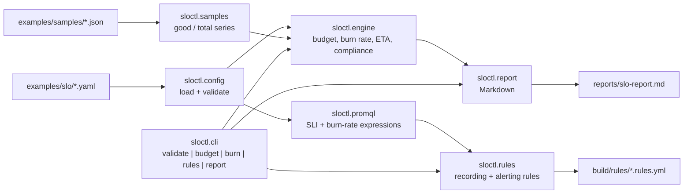

# slo-error-budget-lab

Biblioteca e CLI que transforma definições declarativas de SLI/SLO em números auditáveis — error budget, burn rate multi-janela, ETA de exaustão — e em regras de recording e alerting do Prometheus válidas no `promtool`, tudo offline.

[](https://github.com/dayxus/slo-error-budget-lab/actions/workflows/ci.yml)
[](LICENSE)
[](pyproject.toml)

## O que faz

- Carrega definições de SLO de YAML simples (`objective`, `window`, consulta do SLI, labels) e falha com mensagem clara quando alguma é inválida — sem Prometheus, sem rede, sem dependência exótica.
- Calcula o error budget de cada serviço a partir de séries sintéticas de good/total: budget total, tempo consumido, percentual restante e status `compliant` / `violated`.
- Calcula o burn rate em quatro janelas de lookback (1h, 6h, 1d, 3d), com veredito por janela (`ok` / `slow burn` / `fast burn`) e a ETA projetada de exaustão do budget.
- Gera arquivos de regras do Prometheus — recording rules da razão do SLI, do error budget restante e do burn rate por janela, além de alertas multi-window multi-burn-rate em 14,4x (1h/5m), 6x (6h/30m) e 1x (3d/6h) com `severity: page` / `severity: ticket`.
- Renderiza `reports/slo-report.md`, o relatório Markdown com todas as tabelas de budget e burn rate que a CLI imprime.
- Expõe todo o pipeline como biblioteca: `from sloctl import engine` devolve os mesmos números que a CLI, e `tests/` trava esses valores contra gabaritos calculados à mão.

## Por que isso importa em SRE

Um SLO só é útil se o número por trás dele for reproduzível. Este repo é a calculadora, isolada do backend de métricas: as mesmas fórmulas que o plantonista discute às 3 da manhã — `budget = window * (1 - objective)`, `burn_rate = (1 - good/total) / (1 - objective)`, `ETA = remaining / burn_rate` — estão implementadas uma única vez, testadas contra respostas conhecidas e documentadas em `docs/slo-theory.md`. As regras de alerta geradas seguem o padrão multi-window multi-burn-rate do Google SRE Workbook, então um page significa "o budget está sendo consumido rápido demais para sobreviver à janela" em vez de "a taxa de erro passou de um número que alguém chutou". Como as séries de amostra são fixtures sintéticas, o comportamento é auditável sem acesso a nenhum sistema de produção.

## Arquitetura



`sloctl.models` guarda as dataclasses (`SLISpec`, `SLO`, `Budget`, `BurnWindow`, `Evaluation`); `sloctl.cli` é uma camada fina de `argparse` com exit codes que significam algo.

## Início rápido

Requer Python 3.11+ (os testes e o CI rodam em 3.11, 3.12 e 3.13). Tudo abaixo roda offline.

```bash
git clone https://github.com/dayxus/slo-error-budget-lab.git
cd slo-error-budget-lab
make setup          # cria o .venv e instala o pacote com as dependências de dev
make test           # 148 testes
make budget         # tabela de error budget dos três serviços de exemplo
make burn           # tabela de burn rate multi-janela
make demo           # grava reports/slo-report.md e build/rules/*.rules.yml
make promtool-check # baixa o promtool mais novo e valida as regras geradas
```

Os três exemplos incluídos são `checkout` (99,9% em 30d, saudável), `payments` (99,95% em 30d, queimando) e `search` (99,5% em 30d, já estourado).

## Verifique você mesmo

Cada bloco abaixo é a saída literal do comando imediatamente anterior, em um clone limpo.

`make test`:

```
.venv/bin/python -m pytest -q
........................................................................ [ 48%]
........................................................................ [ 97%]
....                                                                     [100%]
148 passed in 1.31s
```

`python -m sloctl budget --config examples/slo --samples examples/samples`:

```
SERVICE   SLI           OBJECTIVE  WINDOW  BUDGET   CONSUMED  REMAINING  STATUS
--------  ------------  ---------  ------  -------  --------  ---------  ---------
search    availability  99.5%      30d     3h 36m   5h 2m     -40%       violated
checkout  availability  99.9%      30d     43m 12s  2m 9s     95%        compliant
payments  availability  99.95%     30d     21m 36s  9m 50s    54.5%      compliant

3 service(s) evaluated, 2 compliant, 1 over budget
```

A coluna de budget é a matemática da spec, recalculada: 99,9% em 30d dá `43200 min * 0.001 = 43m 12s`, 99,95% dá `21m 36s` e 99,5% dá `3h 36m`. `tests/test_engine.py` trava esses três valores.

`python -m sloctl burn --config examples/slo --samples examples/samples`:

```
SERVICE   WINDOW  GOOD / TOTAL             ERROR RATIO  BURN RATE  VERDICT    ETA
--------  ------  -----------------------  -----------  ---------  ---------  ---------
search    1h      119,159 / 120,000        0.701%       1.40x      slow burn  exhausted
search    6h      714,907 / 720,000        0.707%       1.41x      slow burn  exhausted
search    1d      2,859,622 / 2,880,000    0.708%       1.42x      slow burn  exhausted
search    3d      8,579,331 / 8,640,000    0.702%       1.40x      fast burn  exhausted
checkout  1h      239,991 / 240,000        0.004%       0.04x      ok         760d 1h
checkout  6h      1,439,936 / 1,440,000    0.004%       0.04x      ok         641d 7h
checkout  1d      5,759,712 / 5,760,000    0.005%       0.05x      ok         570d 1h
checkout  3d      17,279,132 / 17,280,000  0.005%       0.05x      ok         567d 10h
payments  1h      176,400 / 180,000        2%           40.00x     fast burn  9h 48m
payments  6h      1,076,224 / 1,080,000    0.35%        6.99x      fast burn  2d 8h
payments  1d      4,315,573 / 4,320,000    0.102%       2.05x      slow burn  7d 23h
payments  3d      12,953,825 / 12,960,000  0.048%       0.95x      ok         17d 3h

12 window(s) measured across 3 service(s); 3 at or above the page threshold
alerting now: payments@1h (fast burn), payments@6h (fast burn), search@3d (fast burn)
```

`python -m sloctl rules generate ...` seguido de `promtool check rules` na release oficial mais nova do Prometheus:

```
promtool, version 3.14.0 (branch: HEAD, revision: d7598b7141418fa35be2b5ec5d0fefb634199610)
  build user:       root@4c568bad4aae
  build date:       20260817-16:46:08
```

```
Checking build/rules/checkout_alerts.rules.yml
  SUCCESS: 3 rules found

Checking build/rules/checkout_recording.rules.yml
  SUCCESS: 16 rules found

Checking build/rules/payments_alerts.rules.yml
  SUCCESS: 3 rules found

Checking build/rules/payments_recording.rules.yml
  SUCCESS: 16 rules found

Checking build/rules/search_alerts.rules.yml
  SUCCESS: 3 rules found

Checking build/rules/search_recording.rules.yml
  SUCCESS: 16 rules found
```

`make lint`:

```
.venv/bin/python -m ruff check .
All checks passed!
.venv/bin/python -m ruff format --check .
23 files already formatted
```

## Manutenção automatizada

O `.github/workflows/maintenance.yml` roda semanalmente (`on: schedule`) e sob demanda. Ele faz quatro coisas, todas trabalho real:

1. Consulta `api.github.com/repos/prometheus/prometheus/releases/latest` e `api.github.com/repos/prometheus/alertmanager/releases/latest` e reescreve a tabela de versões em `docs/versions.md`.
2. Baixa o `promtool` da release mais nova do Prometheus e roda `promtool check rules` de novo sobre as regras recém-geradas — uma mudança de sintaxe PromQL ou de formato de regra lá em cima é pega aqui, não em produção.
3. Escreve `reports/weekly-audit.md` com as versões de upstream, o resultado do `promtool`, a contagem de testes e a cobertura.
4. Commita apenas quando existe diff real (`git diff --quiet && exit 0`) e abre issue com o erro literal do `promtool` quando alguma regra gerada é rejeitada.

## Estrutura do projeto

```
sloctl/
  models.py       dataclasses: SLISpec, SLO, Budget, BurnWindow, Evaluation
  config.py       carrega e valida o YAML dos SLOs, com erros claros
  engine.py       budget, consumo, burn rate, ETA, compliance
  promql.py       expressões PromQL do SLI e do burn rate
  rules.py        recording rules + alertas multi-window multi-burn-rate
  report.py       relatório Markdown a partir das avaliações
  samples.py      carrega as fixtures sintéticas de good/total
  cli.py          subcomandos argparse e exit codes
  __main__.py     python -m sloctl
examples/
  slo/            checkout.yaml, payments.yaml, search.yaml
  samples/        checkout-healthy.json, payments-burning.json, search-violated.json
tests/            testes de engine, config, rules, report e CLI (148)
docs/
  slo-theory.md   a matemática, a tabela de burn rate, a derivação dos alertas
  versions.md     versões de Prometheus / Alertmanager sincronizadas semanalmente
scripts/          gerador de fixtures, downloader do promtool, auditoria semanal
reports/          slo-report.md é gerado localmente; weekly-audit.md é commitado pelo CI
build/            regras geradas e ferramentas baixadas (ignorados pelo git)
.github/workflows/ci.yml, maintenance.yml
Makefile
```

## Limitações e próximos passos

- A verificação roda sobre fixtures sintéticas, não sobre um Prometheus vivo. A CLI e a biblioteca nunca disparam query nem fazem scrape; `sloctl rules generate` produz regras que passaram por validação de sintaxe no `promtool`, não regras que foram carregadas em um servidor em execução e observadas disparando.
- O `scripts/fetch_promtool.py` valida a *sintaxe e o formato* das regras, não a semântica PromQL contra um conjunto de dados real. Uma regra que compila ainda pode estar errada sobre quais séries ela seleciona.
- As fixtures de amostra são densas e igualmente espaçadas, então o engine ainda não trata staleness, reset de contador ou cobertura parcial de janela como um `rate()` real do PromQL trataria. Cobertura menor que a janela do SLO aparece como observação, não é interpolada.
- Roteamento de notificação está fora de escopo: os alertas carregam as labels `severity`, `team` e `runbook_url`, mas nenhuma árvore de rotas do Alertmanager, política de silêncio ou escala de escalonamento é gerada.
- Os limiares de burn rate seguem os padrões do SRE Workbook (14,4x/6x/1x); são configuráveis no YAML do SLO, mas vêm sem um fluxo de calibração para o volume de tráfego de um serviço específico.

---

[English (en)](README.md)

Parte do [portfólio SRE dayxus](https://github.com/dayxus).
